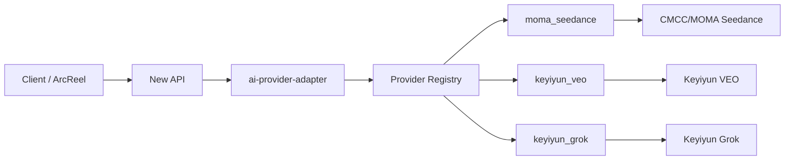

# AI Provider Adapter Design

## Goal

Add an independent `ai-provider-adapter` service that lets New API generate videos through MOMA/CMCC Seedance, Keyiyun VEO, Keyiyun Grok, and future non-standard video upstreams without modifying New API source or changing existing production channels.

## Non-Goals

- Do not modify `/Users/bytedance/dev/drama/new-api`.
- Do not run real paid video generation during default local or CI verification.
- Do not delete the existing `platform` namespace in the 139 cluster as a validation shortcut.

## Architecture

`ai-provider-adapter` is a standalone FastAPI service whose source code lives in the `ai-relay-broker` repo under `provider_adapter/`. New API test channels point their `base_url` at this service. The service exposes the task endpoints New API already knows how to call, then dispatches to provider-specific adapters.



## New API Compatibility

The first supported compatibility surface is the DoubaoVideo task shape:

- `POST /api/v3/contents/generations/tasks`
- `GET /api/v3/contents/generations/tasks/{task_id}`

Optional compatibility surface for Sora-like channels:

- `POST /v1/videos`
- `GET /v1/videos/{task_id}`

The adapter returns stable New API-compatible JSON:

```json
{
  "id": "provider-prefixed-upstream-task-id",
  "model": "doubao-seedance-2.0",
  "status": "running",
  "content": {
    "video_url": ""
  },
  "error": {
    "code": "",
    "message": ""
  }
}
```

For polling, the adapter parses the provider-prefixed task id to recover the provider route. This avoids adding stateful storage and keeps New API unchanged.

## Provider Selection

Provider selection uses this order:

1. Explicit query parameter `provider`, for direct smoke tests.
2. Request header `X-Adapter-Provider`, if a caller injects it later.
3. Model mapping from config, such as `doubao-seedance-2.0 -> moma_seedance`.
4. Default provider from `AI_PROVIDER_ADAPTER_DEFAULT_PROVIDER`.

Task ids returned to New API are prefixed:

- `moma_seedance:cgt-...`
- `keyiyun_veo:...`
- `keyiyun_grok:...`

This makes stateless polling deterministic.

## MOMA Seedance Adapter

The MOMA adapter uses the provided `pythonSDK-0515.zip` wheel in the container image. It must account for the SDK base URL split:

- Mapping query: `POST {root_base_url}/api/v3/mapping/query`, with root `/mapping/query` fallback for legacy gateways.
- Task API: `{root_base_url}/api/v3/contents/generations/tasks`
- Secure channel token: `{root_base_url}/v1/security/token`

Implementation detail:

1. Resolve endpoint by calling `/api/v3/mapping/query` with `{"model":"doubao-seedance-2.0"}`.
2. Instantiate SDK lower-level `AICCClient` or `SeedanceClient` with `base_url={root}/api/v3`, `endpoint={resolved_endpoint}`.
3. Set `is_enable_video_encrypt=false` by default so downstream receives usable result URLs.
4. Add `Input-Has-Video: true` when request content contains `video_url`.

The Helm values set `LOG_LEVEL`, `TOP_LOGGER_LEVEL`, and `TASK_LOGGER_LEVEL` to `ERROR` by default so SDK secure-channel logs do not print Authorization headers.

## Keyiyun VEO/Grok Adapters

Keyiyun VEO create and fetch map to the verified API shape:

- Create: `POST {base_url}/v1/veo/videos`
- Fetch: `GET {base_url}/v1/result/{task_id}`

Grok uses the same adapter class with a provider-level create path once the exact upstream path is confirmed. Until then, tests cover the registry and path configuration rather than a paid real call.

## Configuration

All runtime configuration flows through Helm values.

```yaml
ai-provider-adapter:
  enabled: true
  fullnameOverride: ai-provider-adapter
  image:
    repository: ai-provider-adapter
    tag: staging-139
    pullPolicy: IfNotPresent
  env:
    AI_PROVIDER_ADAPTER_DEFAULT_PROVIDER: moma_seedance
    AI_PROVIDER_ADAPTER_MODEL_PROVIDER_MAP: '{"doubao-seedance-2.0":"moma_seedance"}'
    MOMA_SEEDANCE_BASE_URL: https://zhenze-huhehaote.cmecloud.cn
    MOMA_SEEDANCE_MODEL: doubao-seedance-2.0
    MOMA_SEEDANCE_ENABLE_VIDEO_ENCRYPT: "false"
    KEYIYUN_BASE_URL: https://zcbservice.aizfw.cn/kyyReactApiServer
    KEYIYUN_VEO_CREATE_PATH: /v1/veo/videos
    KEYIYUN_GROK_CREATE_PATH: /v1/grok/videos
  secret:
    create: true
    MOMA_SEEDANCE_API_KEY: ""
    KEYIYUN_API_KEY: ""
```

Secrets are mounted as environment variables. API keys are never logged.

For 139 migration, provider API keys can also be forwarded from the New API channel `Authorization` header. The adapter uses the provider-level Helm secret first; if it is empty, it forwards the New API channel key to the upstream. This lets the existing MOMA channel keep its current key while only changing `base_url` to the adapter service.

## Build And Deployment Integration

The service joins existing `ai-relay-ops` flows:

- `scripts/build-platform-images.sh` builds and saves `ai-provider-adapter` from the broker repo using `Dockerfile.ai-provider-adapter`.
- `scripts/package-platform-bundle.sh` includes the new chart automatically through `charts/platform`.
- `scripts/install-platform-bundle.sh` installs with the same single values file.
- `scripts/verify-platform-chart.sh` checks the new chart dependency and deployment resources.

## Validation Strategy

Local validation:

1. Unit and contract tests with `httpx.MockTransport`.
2. FastAPI smoke for create/fetch endpoints.
3. Docker build smoke.
4. Helm dependency/render verification.

139 validation:

1. Use a temporary namespace such as `platform-adapter-it` for reinstall-style integration validation.
2. Load the bundle images into containerd.
3. Install platform from the generated bundle into the temporary namespace.
4. Create a test-only New API channel that points at `http://ai-provider-adapter.platform.svc.cluster.local`.
5. Run mock upstream smoke from inside the cluster.
6. Only after explicit approval, run one real short video task through New API.

The existing `platform` namespace and production data are not deleted for validation. If a future full reinstall of the original namespace is required, first export database dumps, Secrets, PVC metadata, Helm values, and release state, then restore into a separate namespace before touching the original.

## 139 New API Channel Strategy

After the adapter is deployed in the existing 139 `platform` namespace, New API channel traffic must go through the adapter service:

```text
New API -> ai-provider-adapter -> MOMA/Keyiyun upstream
```

Channel changes:

1. Export a redacted snapshot of existing New API channels before any change.
2. MOMA Seedance: update the existing channel `base_url` to `http://ai-provider-adapter.platform.svc.cluster.local` and keep its current API key and model configuration unchanged.
3. Keyiyun VEO/Grok: do not edit the existing production channel. Add backup test channels named like `Keyiyun VEO via Adapter` and `Keyiyun Grok via Adapter`, with the same upstream API key, adapter service `base_url`, and adapter-routable model names.
4. If smoke fails, rollback MOMA by restoring the exported original `base_url`; delete or disable only the newly added Keyiyun via-adapter test channels.

## Risk Notes

- Real MOMA Seedance calls depend on SDK secure-channel behavior in the 139 runtime.
- Keyiyun Grok create path still needs final upstream confirmation before a paid smoke.
- New API task polling frequency can create repeated provider status calls; tests should verify idempotent fetch behavior.
- Existing cluster data safety is more important than reinstall symmetry; temporary namespace validation is the default.
